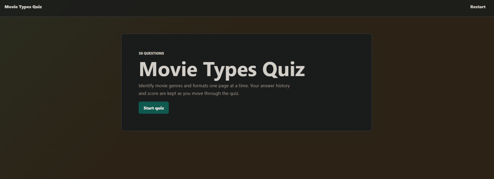
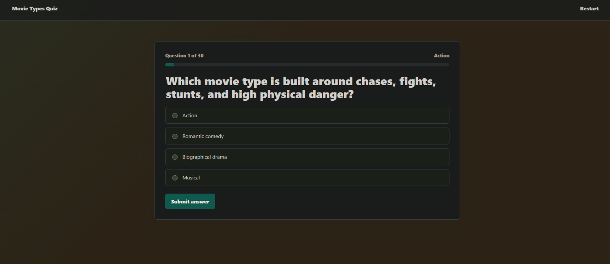
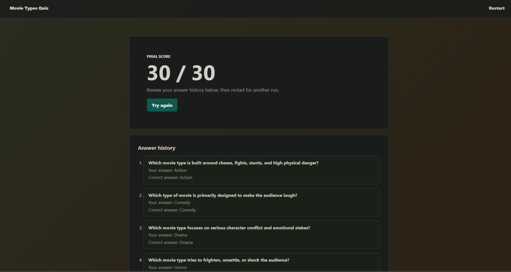
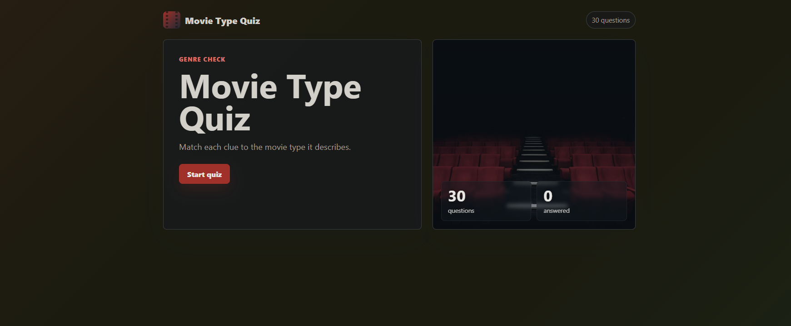
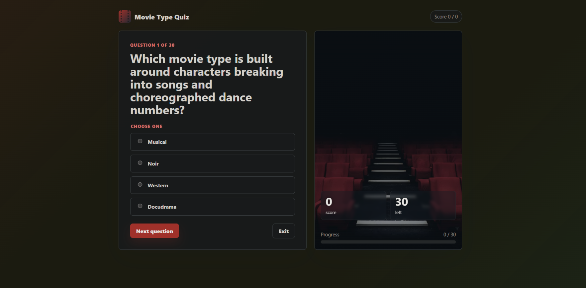
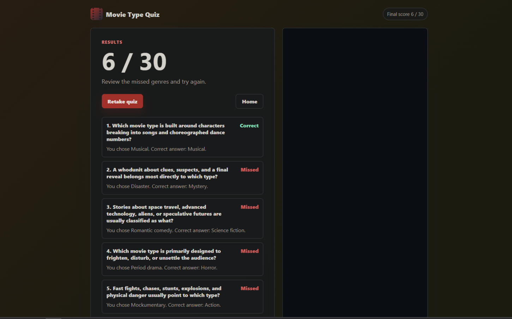
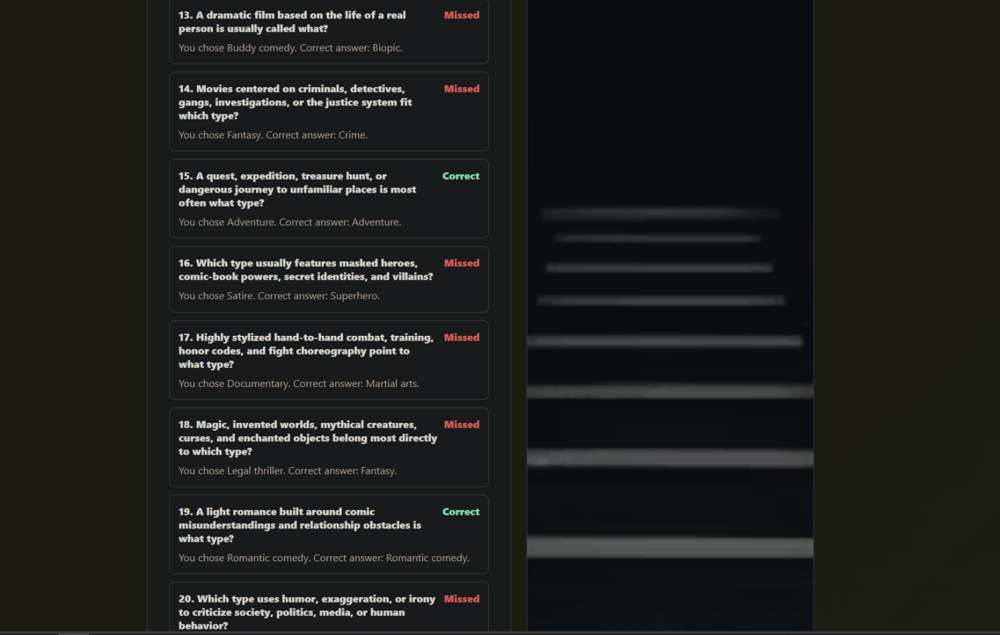

# Movie Types Quiz — Codex vs. Claude Benchmark

A small, head-to-head benchmark. Two coding agents (OpenAI **Codex** and Anthropic
**Claude**) were given the same one-shot prompt to build a multi-page Flask quiz on
the **types/genres of movies**, then judged on the result. Codex ran twice (v1 and a
re-run v2 with a tweaked prompt); Claude ran once.

This repo holds all three submissions side by side, plus the screenshots used to
compare them.

```
claude/      # Claude's submission
codex/v1/    # Codex, first run
codex/v2/    # Codex, second run (tweaked prompt)
screenshots/ # Captures used in this README
```

---

## The prompt

**Claude and Codex v1** got the same prompt:

> Using flask, make a quiz that spans across multiple pages. New page per question,
> while keeping context of what happened last page. Quiz topic is types of movies.
> minimum 30 questions. Don't invoke any of your skills, this is a one-shot prompt.

**Codex v2** got a tweaked version that added a test-yourself instruction and banned
test files:

> …Make the app first, and then test it yourself. Do not make python test files.

---

## Scoreboard

| Submission | Wall time | Output tokens | Questions | Layout | Test files |
| --- | --- | --- | --- | --- | --- |
| **Claude** | 5m 01s | 28.4k | 32 | `app.py` + `questions.py` + templates/static | None |
| **Codex v1** | 5m 31s (done ~4m 30s) | 16.0k | 32 | `app.py` + templates/static + `tests/` | pytest |
| **Codex v2** | 6m 40s | 41.1k | 35 | single `app.py` (inline templates) | None |

All three keep per-question state across pages via Flask's signed `session` cookie
and run on `http://127.0.0.1:5000`.

---

## Claude

One run, no retry. Splits the question bank into its own `questions.py` (32
questions), with Jinja templates and an external stylesheet. Session-cookie state,
progress bar, and a scored per-question review at the end. It did **not** write any
Python test files. There were minor UI rendering issues in places.

No live score during the quiz and no anti-skip guard. Subjectively the UI is the
middle of the three — it leans on a generic dark-gradient "AI default" look.

| Start | Question | Finish |
| --- | --- | --- |
|  |  |  |

---

## Codex v1

32 questions, templates + external stylesheet, and a `tests/` directory — Codex
wrote the **pytest tests before the app**. It includes a nice **Restart** control and
shows a running score during the quiz, plus an anti-skip guard that stops you
advancing past an unanswered question.

The fatal flaw: it set **every correct answer to option A** and rendered the question's
**category in the top-right of the card** — so the answer is visible before you pick.
That lookahead leak is what triggered the v2 re-run.

| Start | Question (note the leaked "Action" label) | Finish |
| --- | --- | --- |
|  |  |  |

---

## Codex v2

Re-run with the tweaked prompt. Everything lives in a single ~960-line `app.py` with
inline (`render_template_string`) templates and 35 questions. Codex **noticed the
every-answer-is-A problem from v1 and fixed it**, distributing correct answers across
positions via an explicit `ANSWER_POSITIONS` table. It tested itself and wrote no
Python test files, as instructed. Keeps the anti-skip guard and the live score.

The finish screen adds a cinema-staircase image for flavor — a creative touch, though
it isn't scaled correctly. Subjectively this is the cleanest-looking of the three.

| Start | Question | Finish | Finish (staircase) |
| --- | --- | --- | --- |
|  |  |  |  |

---

## Observations

- **Correctness on first try:** Claude shipped a working quiz in one pass. Codex v1
  shipped a quiz whose answers were trivially guessable (every answer A + category
  shown on the card). Codex v2 caught and fixed that flaw on the re-run.
- **Testing behavior:** Codex v1 wrote tests *before* the app. Codex v2 and Claude
  wrote no Python test files (v2 was told not to; Claude wasn't asked either way).
- **Extra features Codex added unprompted:** anti-skip guard, a live score during the
  quiz (both runs), a Restart control (v1), and a decorative finish image (v2).
- **Visual polish (subjective):** Codex v2 is the cleanest, Codex v1 is serviceable,
  Claude sits in the middle with a more generic aesthetic.

The benchmark's own point notes: **Codex v1 −3** (answer lookahead leak; tests
written before the app), **Claude −1** (minor UI rendering issues), **Codex v2** net
break-even on the staircase (creativity vs. bad scaling). Live score and design
choices were not scored, as they aren't falsifiable.

---

## Running any submission

Each app is self-contained. From its directory:

```bash
python3 -m venv .venv
source .venv/bin/activate        # Windows: .venv\Scripts\activate
pip install -r requirements.txt
python app.py                    # then open http://127.0.0.1:5000
```

Codex v1 can also be launched with `flask --app app run --debug`, and its tests run
with `python -m pytest -q`.
