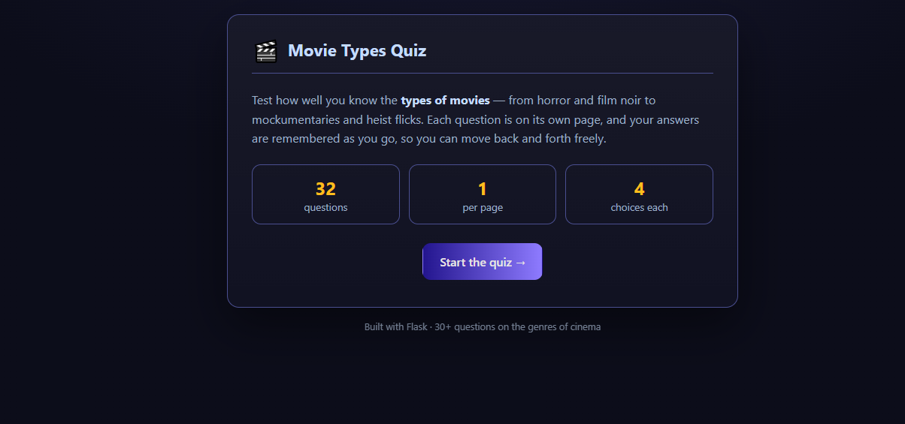
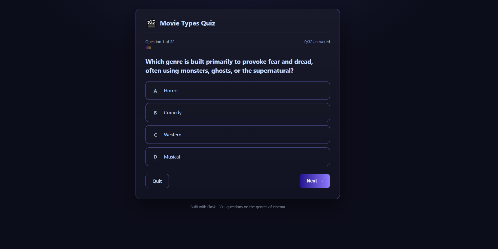
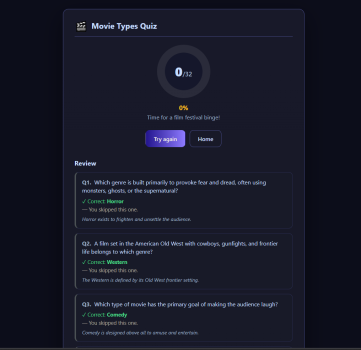

# Scorecard — Claude

> Author's evaluation. The model's own files in this folder are left exactly as it
> produced them; see [`README.md`](README.md) for the model's own writeup.

| Metric | Value |
| --- | --- |
| Wall time | 5m 01s |
| Output tokens | 28.4k |
| Questions | 32 |
| Layout | `app.py` + `questions.py` + templates/static |
| Test files | None |
| **Score** | **−1** |

## Notes

One run, no retry. Splits the question bank into its own `questions.py` (32 questions),
with Jinja templates and an external stylesheet. Session-cookie state, progress bar, and a
scored per-question review at the end. It did **not** write any Python test files. There
were minor UI rendering issues in places.

No live score during the quiz and no anti-skip guard. Subjectively the UI is the middle of
the three — it leans on a generic dark-gradient "AI default" look.

## Screenshots

| Start | Question | Finish |
| --- | --- | --- |
|  |  |  |
