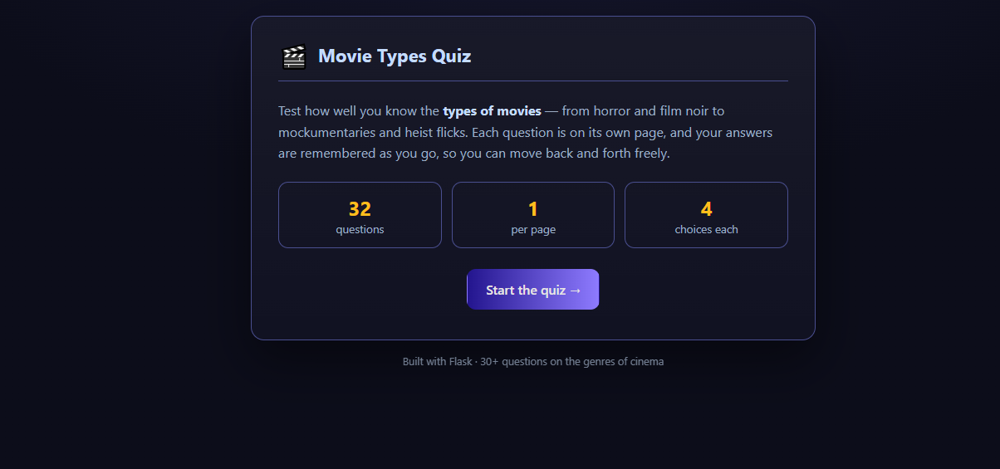
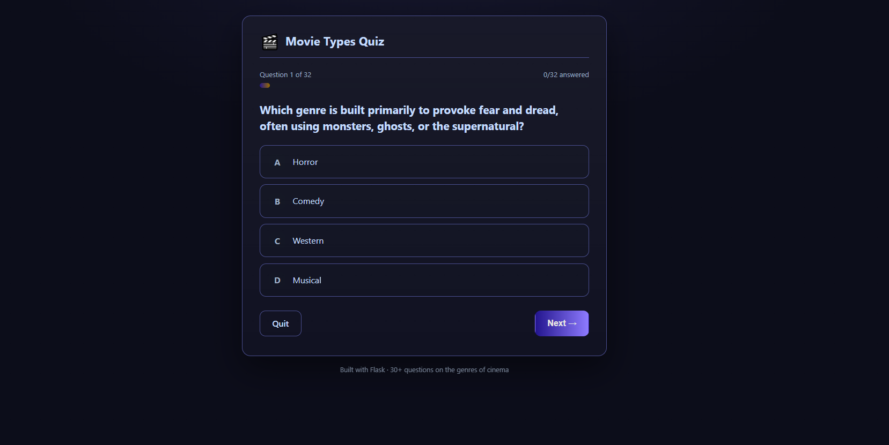
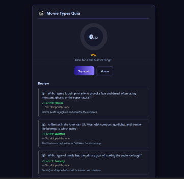

# Scorecard — Claude

## Legacy assessment

The pre-publication scorecard content below is retained verbatim. Its historical score uses a different maintainer scale and is not comparable to the canonical automated quality score.

> Author's evaluation. The model's own files in this folder are left exactly as it
> produced them; see [`README.md`](README.md) for the model's own writeup.

| Metric | Value |
| --- | --- |
| Wall time | 5m 01s |
| Output tokens | 28.4k |
| Questions | 32 |
| Layout | `app.py` + `questions.py` + templates/static |
| Test files | None |
| **Score** | **−1** |

## Notes

One run, no retry. Splits the question bank into its own `questions.py` (32 questions),
with Jinja templates and an external stylesheet. Session-cookie state, progress bar, and a
scored per-question review at the end. It did **not** write any Python test files. There
were minor UI rendering issues in places.

No live score during the quiz and no anti-skip guard. Subjectively the UI is the middle of
the three — it leans on a generic dark-gradient "AI default" look.

## Screenshots

| Start | Question | Finish |
| --- | --- | --- |
|  |  |  |

## Automated blind review

This section is generated from the canonical public aggregation. It is the completed benchmark quality assessment. The Legacy assessment above is retained historical maintainer material on a different scale and is not a competing total.

| Field | Value |
| --- | --- |
| Opaque submission ID | `submission-006` |
| Final review | [`../../reviews/submission-006.md`](../../reviews/submission-006.md) |
| Quiz type | knowledge |
| Questions / options | 32 / 4 |
| Launch / full flow | Yes / Yes |
| Content scope | Yes |
| Scoring/result | Yes |
| Answer leak / position distribution | No / A=16, B=12, C=4, D=0 |
| Skip/direct navigation | No |
| Restart | Yes |
| Tests present / pass status | No / Unverified |
| Capture status | completed |
| Reviewer confidence | High |
| Disagreement status | Not assessed: one canonical blind pass; no independent second pass. |
| Build time | 5m 01s |
| Output tokens | 28.4k |

| Category | Rating | Weighted points |
| --- | ---: | ---: |
| Frontend visual quality and polish | 4/5 | 32/40 |
| UX and interaction design | 4/5 | 32/40 |
| Code quality and maintainability | 4/5 | 12/15 |
| Tests and verification evidence | 2/5 | 2/5 |
| **Quality score** |  | **78/100** |

Quality is recalculated from the integer ratings and excludes build time and output tokens.
