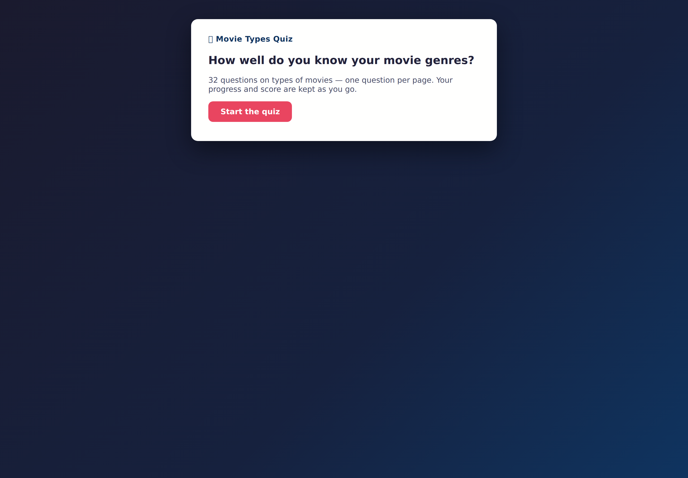
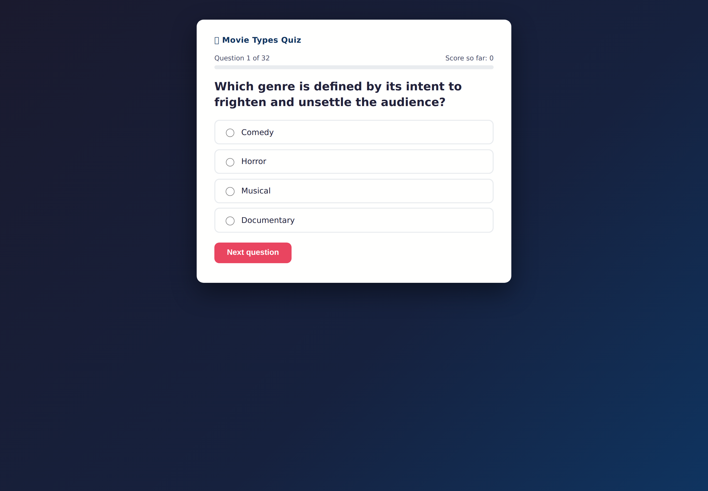
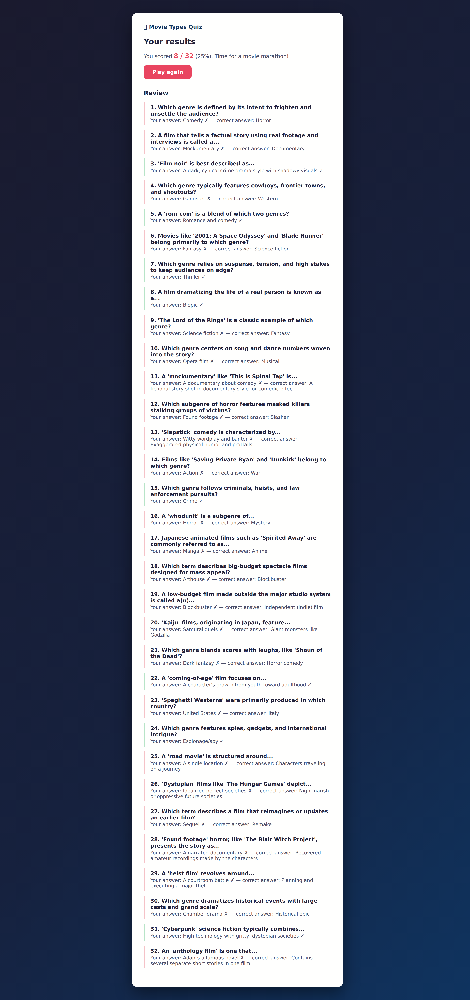

# Scorecard — V1 Fable 5

## Automated blind review

This scorecard is the post-review model-level join for the canonical opaque review. The raw review remains anonymized at [`../../reviews/submission-015.md`](../../reviews/submission-015.md).

| Field | Value |
| --- | --- |
| Opaque submission ID | `submission-015` |
| Final review | [`../../reviews/submission-015.md`](../../reviews/submission-015.md) |
| Quiz type | knowledge |
| Questions / options | 32 / 4 |
| Launch / full flow | Yes / Yes |
| Content scope | Yes |
| Scoring/result | Yes, for the exercised path |
| Answer leak / position distribution | No observed before answering / A: 8, B: 19, C: 5, D: 0 |
| Skip/direct navigation | Unverified |
| Restart | Unverified |
| Tests present / pass status | No / N/A |
| Capture status | completed |
| Reviewer confidence | High |
| Disagreement status | Not assessed: one canonical blind pass; no independent second pass. |
| Build time | 4m 25s |
| Output tokens | 11.7k |

| Category | Rating | Weighted points |
| --- | ---: | ---: |
| Frontend visual quality and polish | 3/5 | 24/40 |
| UX and interaction design | 3/5 | 24/40 |
| Code quality and maintainability | 4/5 | 12/15 |
| Tests and verification evidence | 1/5 | 1/5 |
| **Quality score** |  | **61/100** |

Quality is recalculated from the integer ratings and excludes build time and output tokens.

### Fresh automated-review captures

These are the fresh headed Chromium captures used for the canonical blind review.

| Start | Question | Results |
| --- | --- | --- |
|  |  |  |
