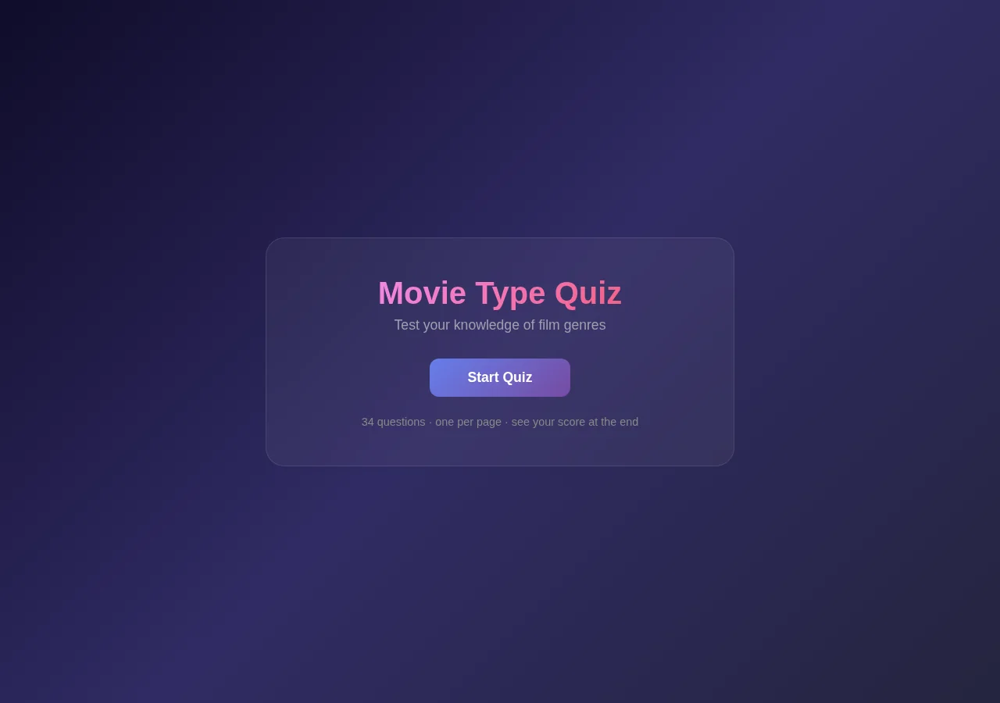
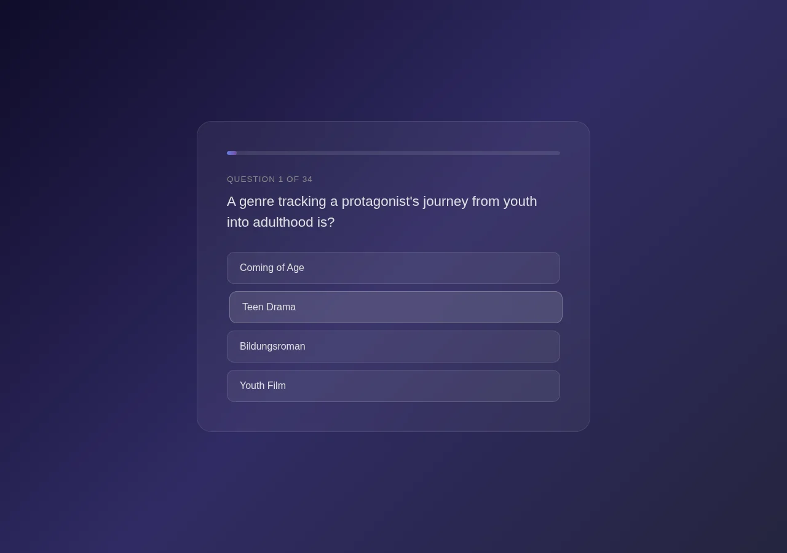
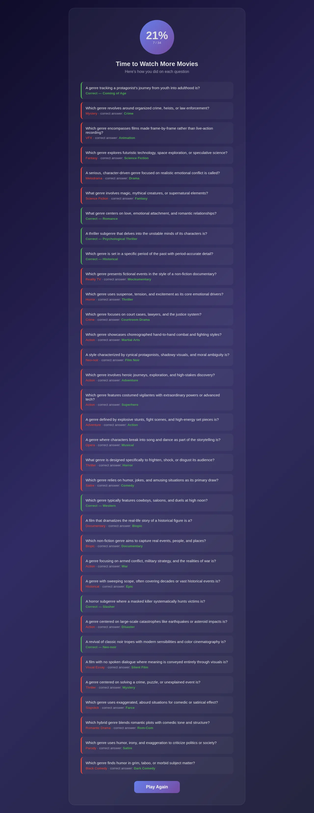

# Scorecard — DeepSeek V4 Flash (`deepseek-v4-flash-free`)

> Factual record, compiled by automated assessment: static code read + live browser run
> (Chromium, fresh Flask launch, Python 3.12). The model's own files in this folder are
> exactly as it produced them. **The qualitative assessment and final score are for the
> repository maintainers** — see the last section.

## Build (opencode session, build turn only)

| Metric | Value |
| --- | --- |
| opencode model id | `deepseek-v4-flash-free` (variant: max) |
| Provider / lab | DeepSeek (served via OpenCode Zen) |
| Wall time (build) | 1m 33s (92.6s) |
| Output tokens (build) | 6,654 |
| Reasoning tokens | 1,261 |

Build turn only (single-turn session).

## Observed facts

| Property | Value |
| --- | --- |
| Runs (fresh Flask launch, Py3.12) | Yes — start → 34 questions → results, no runtime error |
| Questions | 34 |
| Options per question | 4 |
| New page per question | Yes (route `/quiz/<qid>`) |
| State across pages | Flask signed session cookie: `session["order"]` (shuffled 0..33) + `session["answers"]` |
| Correct-answer position distribution | A:7 B:20 C:7 D:0 |
| Answer/category visible before answering | No |
| Anti-skip guard | None — option buttons submit on click; no server check for a missing/empty answer; direct GET advances |
| Live score during quiz | No |
| Restart / Play Again | Yes — "Play Again" → `/` (clears session) |
| Navigation | Forward-only (each option button POSTs → qid+1) |
| Results page | Percentage, score X/34, performance message, per-question review (correct / skipped / incorrect) |
| Final score correct | Yes — option-A run scored 7/34, equal to the A-count |
| Python test files | None |
| `<meta viewport>` | Present |
| `secret_key` | Hardcoded `"movie_quiz_secret_key_2024"` |

Factual notes:
- Question order is randomized per session (`random.shuffle`); option order within a question is fixed.
- Position D is never the correct answer (D:0). One option string has a leading space (`" Bildungsroman"`).
- Page `<title>` reads "Movie Genre Quiz"; landing `<h1>` reads "Movie Type Quiz". `debug=True`.

## Screenshots

| Start | Question | Results |
| --- | --- | --- |
|  |  |  |

## Maintainer assessment

<!-- Repository maintainers: write the qualitative assessment (UI quality, polish,
     subjective calls) and assign the final score here. -->

**Score:** _TBD_
