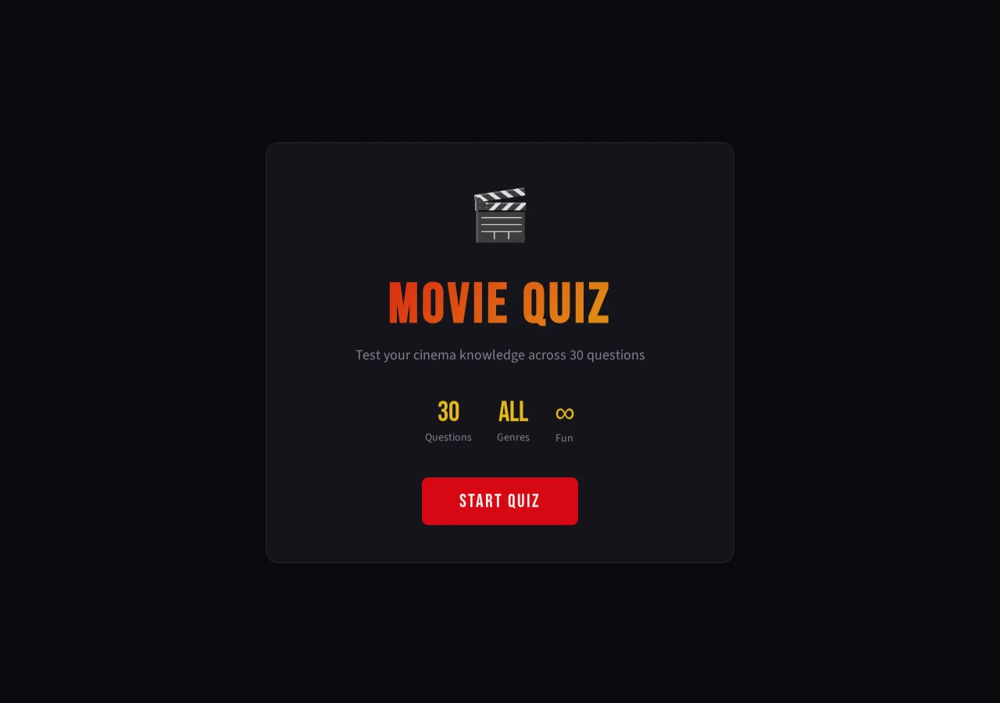
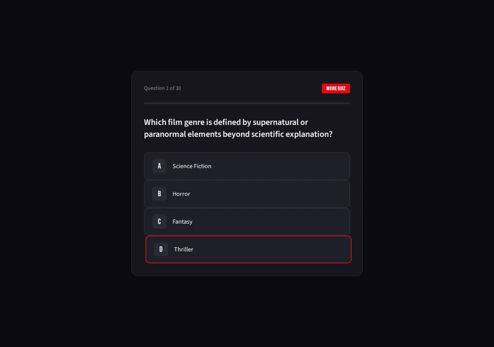
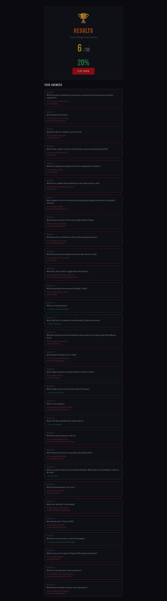

# Scorecard — MiniMax M2.5 (`MiniMax-M2.5`)

## Legacy assessment

The pre-publication scorecard content below is retained verbatim. Its historical score uses a different maintainer scale and is not comparable to the canonical automated quality score.

> Factual record, compiled by automated assessment: static code read + live browser run
> (Chromium, fresh Flask launch, Python 3.12). The model's own files in this folder are
> exactly as it produced them. **The qualitative assessment and final score are for the
> repository maintainers** — see the last section.

## Build (opencode session, build turn only)

| Metric | Value |
| --- | --- |
| opencode model id | `MiniMax-M2.5` |
| Provider / lab | MiniMax (served via minimax-coding-plan) |
| Wall time (build) | 3m 51s (230.9s) |
| Output tokens (build) | 15,396 |
| Reasoning tokens | 0 (not exposed by provider) |

Build turn only (single-turn session).

## Observed facts

| Property | Value |
| --- | --- |
| Runs (fresh Flask launch, Py3.12) | Yes — start → 30 questions → results, no runtime error |
| Questions | 30 |
| Options per question | 4 |
| App layout | `app.py` + templates (index, question, feedback, results); a `SPEC.md` is also present in the folder |
| New page per question | Yes (route `/question`); a separate feedback page follows each question (two pages per question) |
| State across pages | Flask signed session cookie: `current_question`, `answers`, `score` |
| Correct-answer position distribution | A:6 B:16 C:7 D:1 |
| Answer/category visible before answering | No (correct answer shown afterward on the feedback page) |
| Anti-skip guard | No server guard; radio `required` and submit hidden until a radio is selected (client) |
| Live score during quiz | No |
| Restart / Play Again | Yes — "PLAY AGAIN" → `/reset` (clears session) |
| Navigation | Forward-only (question → feedback → next) |
| Results page | Score X/30, percentage, performance message, full per-question review (green/red) |
| Final score correct | Yes — option-A run scored 6/30, equal to the A-count |
| Python test files | None |
| `<meta viewport>` | Present |
| `secret_key` | Hardcoded `"movie-quiz-secret-key-change-in-production"` |

Factual notes:
- The results template indexes `answers[i]` for every question; reaching `/results` before all answers are recorded would raise an IndexError (not reached in normal forward play).
- Option-text typos exist in the data (e.g. "The Texas Chainaw Massacre", "Darryn"). Source binds `port=5001`, `debug=True`.

## Screenshots

| Start | Question | Results |
| --- | --- | --- |
|  |  |  |

## Maintainer assessment

<!-- Repository maintainers: write the qualitative assessment (UI quality, polish,
     subjective calls) and assign the final score here. -->

**Score:** _TBD_

## Automated blind review

This section is generated from the canonical public aggregation. It is the completed benchmark quality assessment. The Legacy assessment above is retained historical maintainer material on a different scale and is not a competing total.

| Field | Value |
| --- | --- |
| Opaque submission ID | `submission-004` |
| Final review | [`../../reviews/submission-004.md`](../../reviews/submission-004.md) |
| Quiz type | knowledge |
| Questions / options | 30 / 4 |
| Launch / full flow | Yes / Yes |
| Content scope | No — substantial drift |
| Scoring/result | Yes |
| Answer leak / position distribution | No / A: 6, B: 16, C: 7, D: 1 |
| Skip/direct navigation | No — only guarded in the normal UI |
| Restart | Unverified |
| Tests present / pass status | No / N/A |
| Capture status | completed |
| Reviewer confidence | High |
| Disagreement status | Not assessed: one canonical blind pass; no independent second pass. |
| Build time | 3m 51s |
| Output tokens | 15,396 |

| Category | Rating | Weighted points |
| --- | ---: | ---: |
| Frontend visual quality and polish | 3/5 | 24/40 |
| UX and interaction design | 3/5 | 24/40 |
| Code quality and maintainability | 3/5 | 9/15 |
| Tests and verification evidence | 1/5 | 1/5 |
| **Quality score** |  | **58/100** |

Quality is recalculated from the integer ratings and excludes build time and output tokens.

### Fresh automated-review captures

These are the fresh headed Chromium captures used for the canonical blind review.

| Start | Question | Results |
| --- | --- | --- |
|  |  |  |
