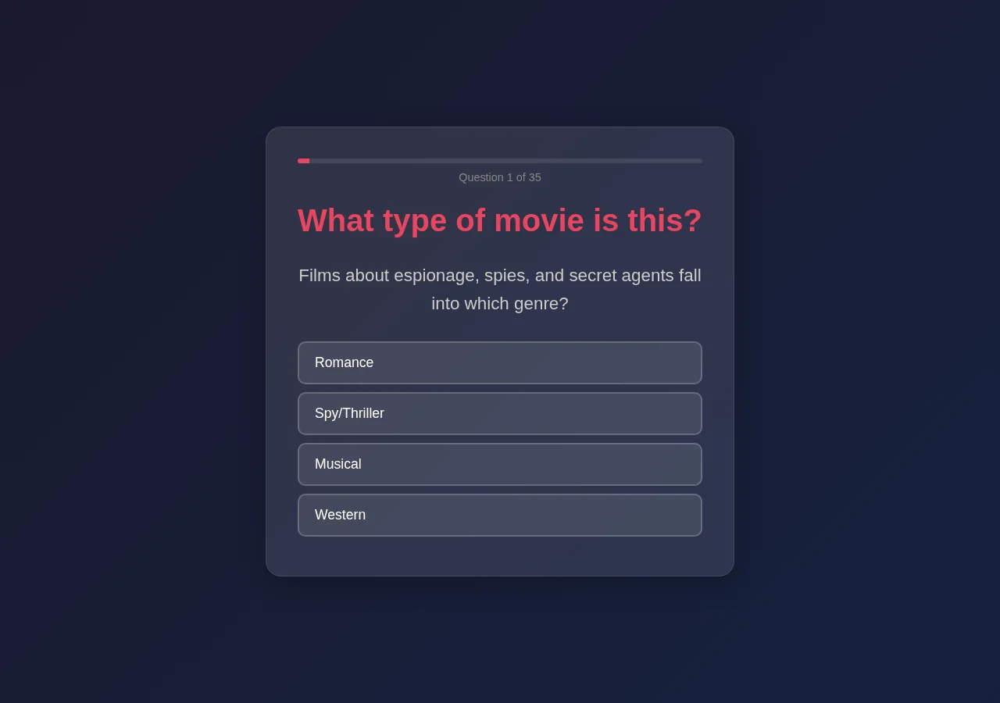
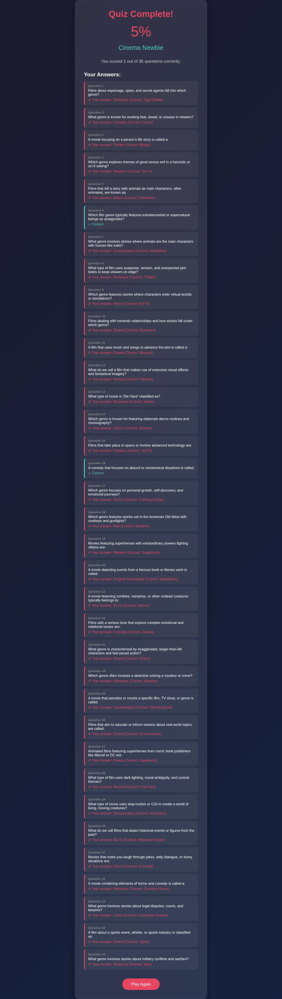

# Scorecard — MiniMax M2.7 (`MiniMax-M2.7-highspeed`)

> Factual record, compiled by automated assessment: static code read + live browser run
> (Chromium, fresh Flask launch, Python 3.12). The model's own files in this folder are
> exactly as it produced them. **The qualitative assessment and final score are for the
> repository maintainers** — see the last section.

## Build (opencode session, build turn only)

| Metric | Value |
| --- | --- |
| opencode model id | `MiniMax-M2.7-highspeed` |
| Provider / lab | MiniMax (served via minimax-coding-plan) |
| Wall time (build) | 1m 52s (112.1s) |
| Output tokens (build) | 4,924 |
| Reasoning tokens | 0 (not exposed by provider) |

Build turn only (single-turn session).

## Observed facts

| Property | Value |
| --- | --- |
| Runs (fresh Flask launch, Py3.12) | Yes — start → 35 questions → results, no runtime error |
| Questions | 35 |
| Options per question | 4 |
| App layout | `app.py` + templates (base, start, question, results) |
| New page per question | Yes (distinct URLs `/question/<q_num>`) |
| State across pages | Flask signed session cookie: `score`, `answers`, `question_index`, `shuffled_questions` |
| Correct-answer position distribution | A:2 B:24 C:9 D:0 (over each question's fixed options array) |
| Answer/category visible before answering | No |
| Anti-skip guard | Missing-session redirects to start; no guard against jumping ahead via direct `/question/<n>` URL; out-of-order answering possible |
| Live score during quiz | No |
| Restart / Play Again | Yes — "Play Again" → `/` (clears session) |
| Navigation | Forward-only (option submit → next/<q_num+1>); URLs not blocked from manipulation |
| Results page | Percentage, grade, "You scored X out of 35", per-question review (your answer vs correct) |
| Final score correct | Yes — option-A run scored 2/35, equal to the A-count |
| Python test files | None |
| `<meta viewport>` | Present |
| `secret_key` | Hardcoded `"movie_quiz_secret_key_123"` |

Factual notes:
- Question order is randomized per session (`random.sample`); option order within a question is fixed.
- Indexing `shuffled_questions[q_num]` is not bounds-checked; a `/question/<n>` with n ≥ 35 would raise an IndexError. Some answer keys are debatable on content grounds (e.g. a question with both "Horror" and "Sci-Fi" options keyed to "Horror"). `debug=True`.

## Screenshots

| Start | Question | Results |
| --- | --- | --- |
|  |  |  |

## Maintainer assessment

<!-- Repository maintainers: write the qualitative assessment (UI quality, polish,
     subjective calls) and assign the final score here. -->

**Score:** _TBD_
