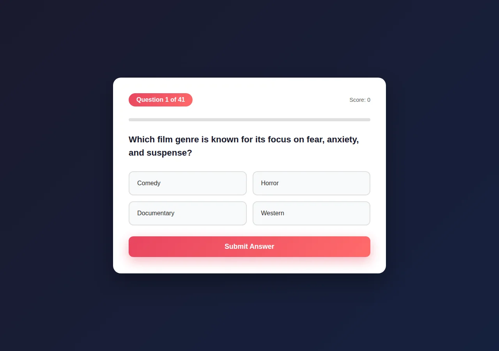
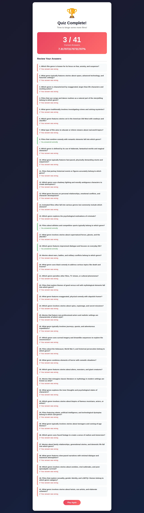

# Scorecard — MiniMax M2 (`MiniMax-M2`)

> Factual record, compiled by automated assessment: static code read + live browser run
> (Chromium, fresh Flask launch, Python 3.12). The model's own files in this folder are
> exactly as it produced them. **The qualitative assessment and final score are for the
> repository maintainers** — see the last section.

## Build (opencode session, build turn only)

| Metric | Value |
| --- | --- |
| opencode model id | `MiniMax-M2` |
| Provider / lab | MiniMax (served via minimax-coding-plan) |
| Wall time (build) | 1m 41s (100.7s) |
| Output tokens (build) | 7,786 |
| Reasoning tokens | 0 (not exposed by provider) |

Build turn only (single-turn session).

## Observed facts

| Property | Value |
| --- | --- |
| Runs (fresh Flask launch, Py3.12) | Yes — start → 41 questions → results, no runtime error |
| Questions | 41 |
| Options per question | 4 |
| App layout | `app.py` + templates (index, question, results) + `requirements.txt` |
| New page per question | Yes — single `/question` route re-rendered (server-driven index) |
| State across pages | Flask signed session cookie: `score`, `question_index`, `answers` |
| Correct-answer position distribution | A:3 B:34 C:4 D:0 |
| Answer/category visible before answering | No (a "last answer" block shows Correct/Incorrect for the previous question) |
| Anti-skip guard | Empty POST re-renders the same question (index not incremented); radio `required` (client) |
| Live score during quiz | Yes — "Score: N" on each question page (browser-confirmed) |
| Restart / Play Again | Yes — `/restart` (clears session) |
| Navigation | Forward-only |
| Results page | Score X/41, percentage, performance message, per-question review (correct/incorrect flag) |
| Final score correct | Yes — option-A run scored 3/41, equal to the A-count |
| Python test files | None |
| `<meta viewport>` | Present |
| `secret_key` | Hardcoded `"moviequizsecretkey123"` |

Factual notes:
- Landing copy states "40 questions" while the bank has 41 entries; results uses the dynamic total (41).
- `int(request.form["answer"])` would raise on a non-integer POST value (not reachable via the UI). `debug=True`.

## Screenshots

| Start | Question | Results |
| --- | --- | --- |
|  |  |  |

## Maintainer assessment

<!-- Repository maintainers: write the qualitative assessment (UI quality, polish,
     subjective calls) and assign the final score here. -->

**Score:** _TBD_
