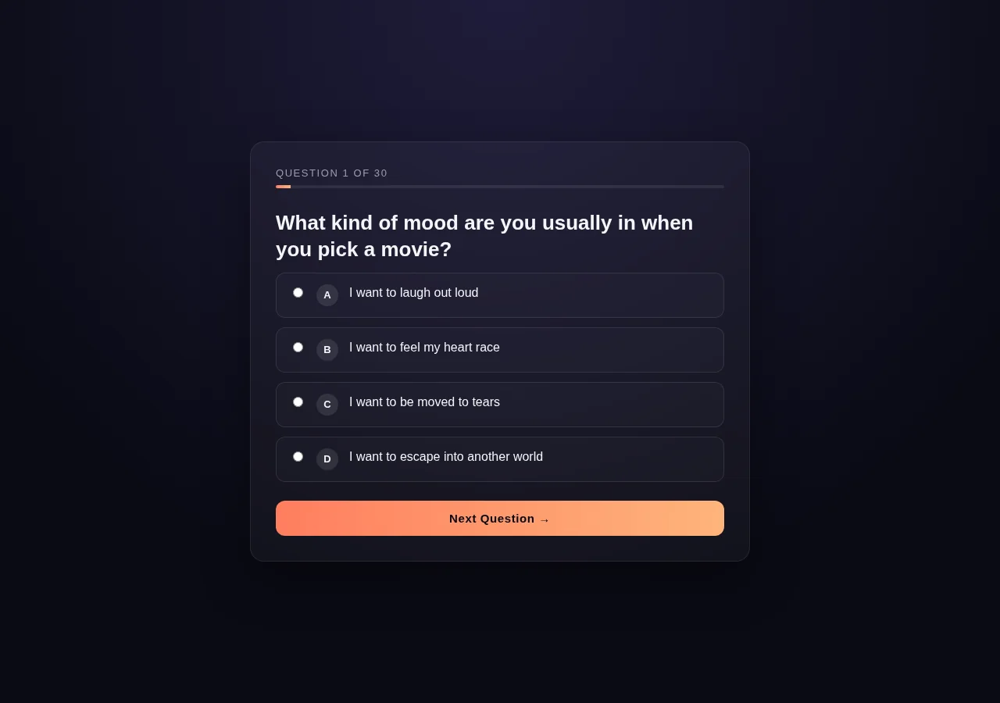
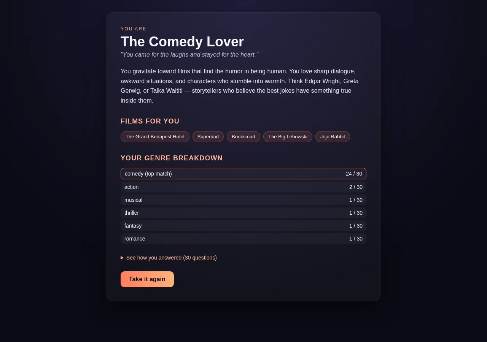

# Scorecard — MiniMax M3 (`MiniMax-M3`)

> Factual record, compiled by automated assessment: static code read + live browser run
> (Chromium, fresh Flask launch, Python 3.12). The model's own files in this folder are
> exactly as it produced them. **The qualitative assessment and final score are for the
> repository maintainers** — see the last section.

## Build (opencode session, build turn only)

| Metric | Value |
| --- | --- |
| opencode model id | `MiniMax-M3` |
| Provider / lab | MiniMax (served via minimax-coding-plan) |
| Wall time (build) | 2m 24s (144.2s) |
| Output tokens (build) | 8,570 |
| Reasoning tokens | 0 (not exposed by provider) |

Build turn only (single-turn session).

## Observed facts

| Property | Value |
| --- | --- |
| Runs (fresh Flask launch, Py3.12) | Yes — 30 questions → result, no runtime error |
| Quiz type | Personality / genre-match — options map to genre categories; **there are no correct/incorrect answers** |
| Questions | 30 |
| Options per question | 4 |
| App layout | Single `app.py` with inline templates (question, result) |
| New page per question | Yes (route `/question/<q>`); `/` redirects to `/question/1` (no separate landing page) |
| State across pages | Flask signed session cookie: `answers` (list of chosen genre categories) |
| Correct-answer position distribution | N/A (no correct answers) |
| Answer/category visible before answering | The genre each option maps to is present in the radio `value` attribute in page markup (not in the visible option text); there is no correct answer to leak |
| Anti-skip guard | Yes — `/result` redirects to the first unanswered question; q-range and category validated server-side; radio `required` (client) |
| Live score during quiz | No (progress indicator + previous answer shown) |
| Restart / Play Again | Yes — "Take it again" → home (clears session) |
| Navigation | Forward-only |
| Results page | Profile title, tagline, summary, recommended films, genre breakdown (count/total per category, top highlighted), collapsible per-question review. No X/N correctness score (preference quiz) |
| Final result | Top-tallied genre category; the option-A traversal produced "The Comedy Lover" (comedy 24/30) |
| Python test files | None |
| `<meta viewport>` | Present |
| `secret_key` | Hardcoded `"movie-quiz-secret-key-change-me"` |

Factual notes:
- 9 result categories defined (comedy, drama, thriller, fantasy, scifi, action, romance, horror, musical).
- Visiting `/` clears the session and restarts at question 1. `debug=True`.

## Screenshots

| Start (= Question 1) | Question | Result |
| --- | --- | --- |
|  |  |  |

## Maintainer assessment

<!-- Repository maintainers: write the qualitative assessment (UI quality, polish,
     subjective calls) and assign the final score here. -->

**Score:** _TBD_
