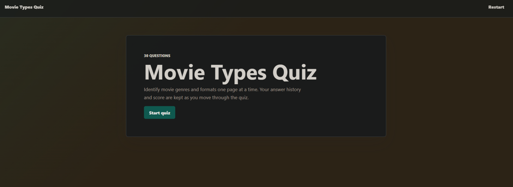
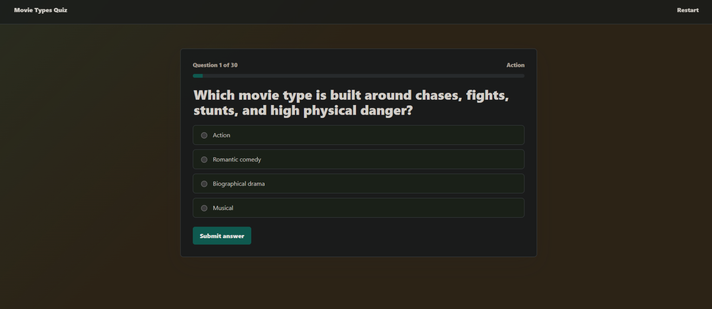
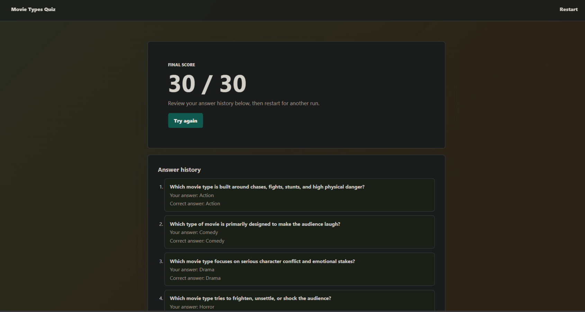

# Scorecard — Codex v1

## Legacy assessment

The pre-publication scorecard content below is retained verbatim. Its historical score uses a different maintainer scale and is not comparable to the canonical automated quality score.

> Author's evaluation. The model's own files in this folder are left exactly as it
> produced them; see [`README.md`](README.md) for the model's own writeup.

| Metric | Value |
| --- | --- |
| Wall time | 5m 31s (done ~4m 30s) |
| Output tokens | 16.0k |
| Questions | 30 |
| Layout | `app.py` + templates/static + `tests/` |
| Test files | pytest |
| **Score** | **−3** |

## Notes

30 questions, templates + external stylesheet, and a `tests/` directory — Codex wrote the
**pytest tests before the app**. It includes a nice **Restart** control and shows a running
score during the quiz, plus an anti-skip guard that stops you advancing past an unanswered
question.

The fatal flaw: it set **every correct answer to option A** and rendered the question's
**category in the top-right of the card** — so the answer is visible before you pick. That
lookahead leak is what triggered the v2 re-run.

## Screenshots

| Start | Question (note the leaked "Action" label) | Finish |
| --- | --- | --- |
|  |  |  |

## Automated blind review

This section is generated from the canonical public aggregation. It is the completed benchmark quality assessment. The Legacy assessment above is retained historical maintainer material on a different scale and is not a competing total.

| Field | Value |
| --- | --- |
| Opaque submission ID | `submission-008` |
| Final review | [`../../../reviews/submission-008.md`](../../../reviews/submission-008.md) |
| Quiz type | knowledge |
| Questions / options | 30 / 4 |
| Launch / full flow | Yes / Yes |
| Content scope | Yes |
| Scoring/result | Yes |
| Answer leak / position distribution | Yes / A: 30, B: 0, C: 0, D: 0 |
| Skip/direct navigation | Yes — prevented |
| Restart | Unverified |
| Tests present / pass status | Yes / Yes |
| Capture status | completed |
| Reviewer confidence | High |
| Disagreement status | Not assessed: one canonical blind pass; no independent second pass. |
| Build time | 5m 31s (done ~4m 30s) |
| Output tokens | 16.0k |

| Category | Rating | Weighted points |
| --- | ---: | ---: |
| Frontend visual quality and polish | 3/5 | 24/40 |
| UX and interaction design | 2/5 | 16/40 |
| Code quality and maintainability | 4/5 | 12/15 |
| Tests and verification evidence | 4/5 | 4/5 |
| **Quality score** |  | **56/100** |

Quality is recalculated from the integer ratings and excludes build time and output tokens.

### Fresh automated-review captures

These are the fresh headed Chromium captures used for the canonical blind review.

| Start | Question | Results |
| --- | --- | --- |
|  |  |  |
