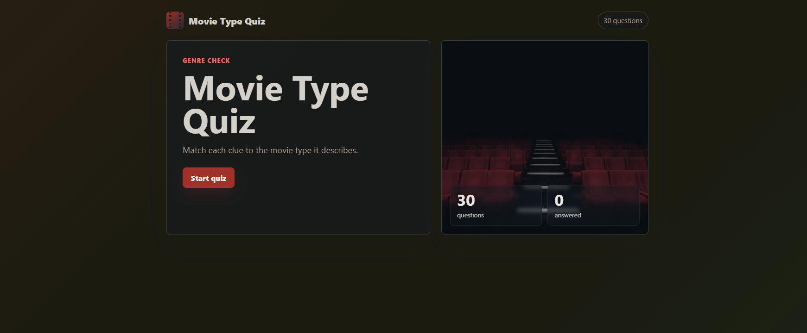
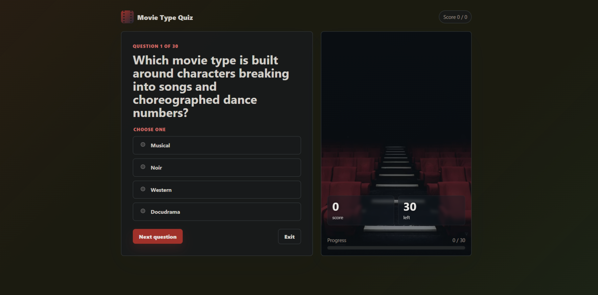
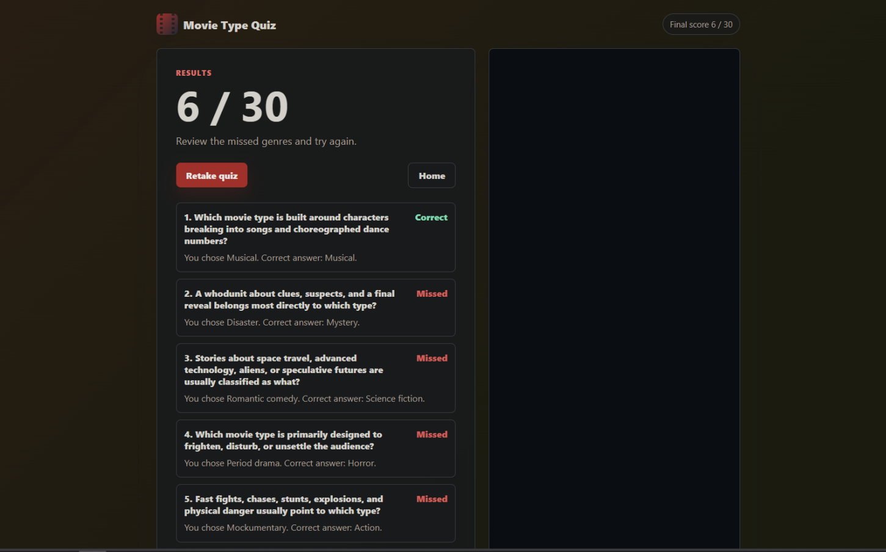
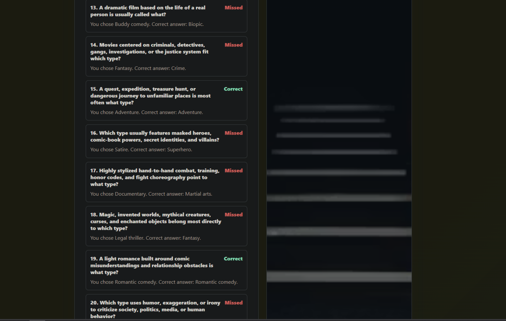

# Scorecard — Codex v2

## Legacy assessment

The pre-publication scorecard content below is retained verbatim. Its historical score uses a different maintainer scale and is not comparable to the canonical automated quality score.

> Author's evaluation. The model's own files in this folder are left exactly as it
> produced them. (Codex v2 did not write its own README.)

| Metric | Value |
| --- | --- |
| Wall time | 6m 40s |
| Output tokens | 41.1k |
| Questions | 30 |
| Layout | single `app.py` (inline templates) |
| Test files | None |
| **Score** | **+2** |

## Notes

Re-run with the tweaked prompt. Everything lives in a single ~960-line `app.py` with
inline (`render_template_string`) templates and 30 questions. Codex **noticed the
every-answer-is-A problem from v1 and fixed it**, distributing correct answers across
positions via an explicit `ANSWER_POSITIONS` table. It tested itself and wrote no Python
test files, as instructed. Keeps the anti-skip guard and the live score.

The finish screen adds a cinema-staircase image for flavor — a creative touch, though it
isn't scaled correctly. Subjectively this is the cleanest-looking of the three, and the
start screen is a standout.

## Screenshots

| Start | Question | Finish | Finish (staircase) |
| --- | --- | --- | --- |
|  |  |  |  |

## Automated blind review

This section is generated from the canonical public aggregation. It is the completed benchmark quality assessment. The Legacy assessment above is retained historical maintainer material on a different scale and is not a competing total.

| Field | Value |
| --- | --- |
| Opaque submission ID | `submission-001` |
| Final review | [`../../../reviews/submission-001.md`](../../../reviews/submission-001.md) |
| Quiz type | knowledge |
| Questions / options | 30 / 4 |
| Launch / full flow | Yes / Yes |
| Content scope | Yes |
| Scoring/result | Yes |
| Answer leak / position distribution | No / Balanced: A 8, B 7, C 8, D 7 |
| Skip/direct navigation | Sensibly handled |
| Restart | Yes |
| Tests present / pass status | No / N/A |
| Capture status | completed |
| Reviewer confidence | High |
| Disagreement status | Not assessed: one canonical blind pass; no independent second pass. |
| Build time | 6m 40s |
| Output tokens | 41.1k |

| Category | Rating | Weighted points |
| --- | ---: | ---: |
| Frontend visual quality and polish | 4/5 | 32/40 |
| UX and interaction design | 4/5 | 32/40 |
| Code quality and maintainability | 4/5 | 12/15 |
| Tests and verification evidence | 2/5 | 2/5 |
| **Quality score** |  | **78/100** |

Quality is recalculated from the integer ratings and excludes build time and output tokens.

### Fresh automated-review captures

These are the fresh headed Chromium captures used for the canonical blind review.

| Start | Question | Results |
| --- | --- | --- |
|  |  |  |
