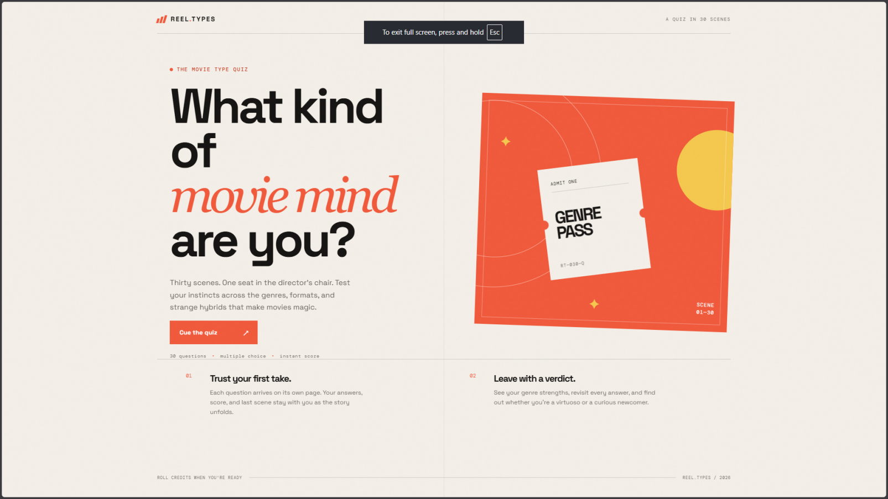
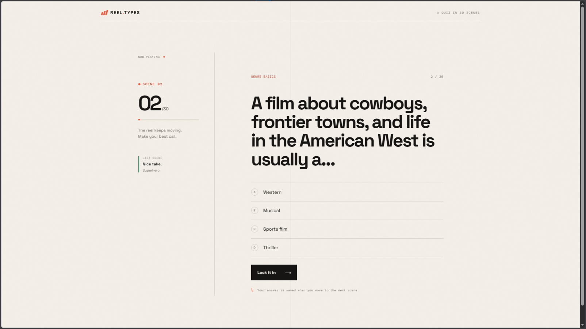
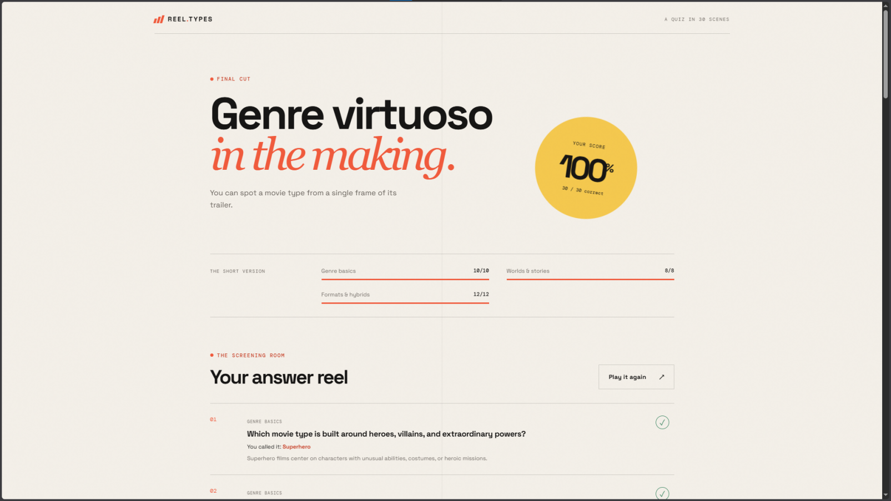

# Scorecard — Codex v3 Luna

## Legacy assessment

The pre-publication scorecard content below is retained verbatim. Its historical score uses a different maintainer scale and is not comparable to the canonical automated quality score.

> Maintainer record. This run used the original one-shot prompt shared by Claude and
> Codex v1; it is kept as a separate Codex v3 variant rather than renamed to v1.

| Metric | Value |
| --- | --- |
| Wall time | 6m 38s |
| Output tokens | 18.4k |
| Questions | 30 |
| Layout | `app.py` + templates/static |
| Test files | None |
| **Score** | **+3** |

## Observed facts

| Property | Value |
| --- | --- |
| New page per question | Yes — `/quiz` advances one question per POST |
| State across pages | Flask signed session cookie: `session["quiz"]` stores index, score, answer indices, and previous result |
| Correct-answer position distribution | A:30 B:0 C:0 D:0 |
| Answer/category visible before answering | No exact answer leak; broad category labels are shown, but they do not identify the keyed answer |
| Anti-skip guard | Yes — the server controls the current question and validates submitted choices |
| Live score during quiz | No |
| Restart / Play Again | Yes — `Play it again` clears the quiz at `/restart` |
| Results page | Percentage, verdict, category breakdown, explanations, and a per-question answer review |
| Final score correct | Yes — a complete correct-answer flow rendered 30/30 |
| Python test files | None present in the captured submission |
| Self-testing | Yes — tested itself, but wrote no app test file |

## Notes

The frontend is stunning, with a particularly strong finish screen and a nice category
percentage breakdown. It avoided the lookahead issue and tested itself, but wrote no app
test file (−1) and all 30 correct answers are option A, making the answer pattern easy to
exploit (−1). It took the longest of the three runs at 6m 38s and used the most output
tokens at 18.4k, though it is also the cheapest model; overall this is still a very good
result. **Final score: +3.**

## Screenshots

| Start | Question | Finish |
| --- | --- | --- |
|  |  |  |

## Automated blind review

This section is generated from the canonical public aggregation. It is the completed benchmark quality assessment. The Legacy assessment above is retained historical maintainer material on a different scale and is not a competing total.

| Field | Value |
| --- | --- |
| Opaque submission ID | `submission-009` |
| Final review | [`../../../reviews/submission-009.md`](../../../reviews/submission-009.md) |
| Quiz type | knowledge |
| Questions / options | 30 / 4 |
| Launch / full flow | Yes / Yes |
| Content scope | Yes |
| Scoring/result | Yes |
| Answer leak / position distribution | No / A: 30, B: 0, C: 0, D: 0 |
| Skip/direct navigation | Sensibly handled; no bypass found |
| Restart | Yes |
| Tests present / pass status | No / N/A |
| Capture status | completed |
| Reviewer confidence | High |
| Disagreement status | Not assessed: one canonical blind pass; no independent second pass. |
| Build time | 6m 38s |
| Output tokens | 18.4k |

| Category | Rating | Weighted points |
| --- | ---: | ---: |
| Frontend visual quality and polish | 5/5 | 40/40 |
| UX and interaction design | 3/5 | 24/40 |
| Code quality and maintainability | 4/5 | 12/15 |
| Tests and verification evidence | 1/5 | 1/5 |
| **Quality score** |  | **77/100** |

Quality is recalculated from the integer ratings and excludes build time and output tokens.

### Fresh automated-review captures

These are the fresh headed Chromium captures used for the canonical blind review.

| Start | Question | Results |
| --- | --- | --- |
|  |  |  |
