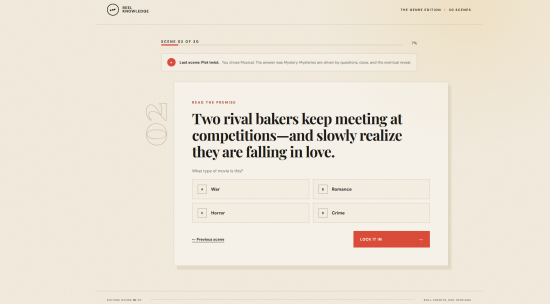
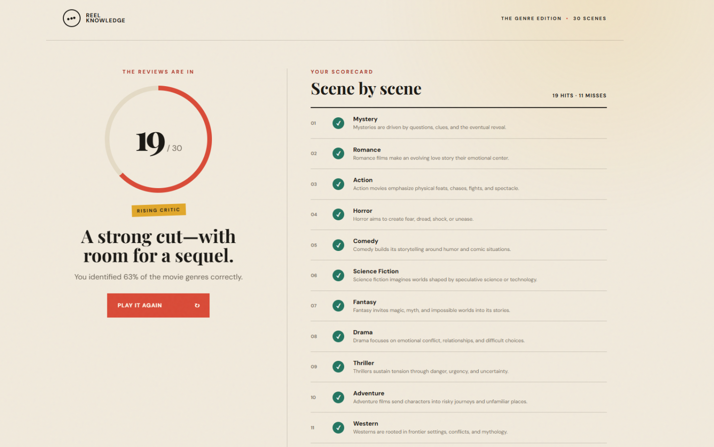

# Scorecard — Codex v3 Sol

> Maintainer record. This run used the original one-shot prompt shared by Claude and
> Codex v1; it is kept as a separate Codex v3 variant rather than renamed to v1.

| Metric | Value |
| --- | --- |
| Wall time | 6m 14s |
| Output tokens | 14.0k |
| Questions | 30 |
| Layout | `app.py` + templates/static + `test_app.py` |
| Test files | `test_app.py` (pytest-style) |
| **Score** | **+5** |

## Observed facts

| Property | Value |
| --- | --- |
| New page per question | Yes — `/quiz/<number>` |
| State across pages | Flask signed session cookie: `session["answers"]` stores the selected answers and results |
| Correct-answer position distribution | A:9 B:14 C:7 D:0 |
| Answer/category visible before answering | No |
| Anti-skip guard | Yes — missing/invalid answers are rejected server-side, and future question URLs redirect to the first unanswered question |
| Live score during quiz | No |
| Restart / Play Again | Yes — `Begin a fresh screening` / `Play it again` resets the session |
| Navigation | Sequential, with a previous-scene link; revisiting a completed question replaces its saved answer |
| Results page | Score and percentage, rank/message, and a full scene-by-scene review |
| Final score correct | Yes — the complete correct-answer flow rendered 30/30; the included test suite also passed |
| Python test files | Yes — `test_app.py` covers question count, full flow/scoring, anti-skip, and invalid answers |
| Self-testing | Yes — tested itself |

## Notes

This is a genuinely strong result: the answer key is comparatively well distributed (A is
correct for 9 of 30 questions, 30%), there is no lookahead issue, and the model wrote a
test file and tested the app itself. The frontend is gorgeous, and the 14.0k output-token
build is notably efficient. **Final score: +5.**

## Screenshots

| Start | Question | Finish |
| --- | --- | --- |
|  |  |  |
