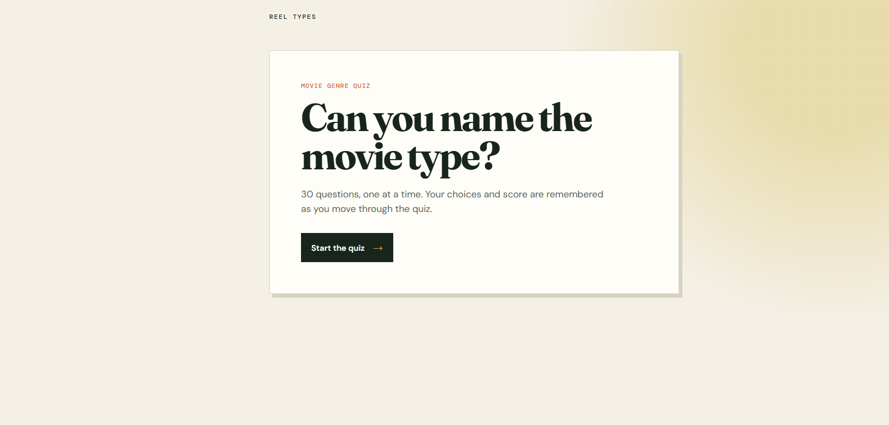
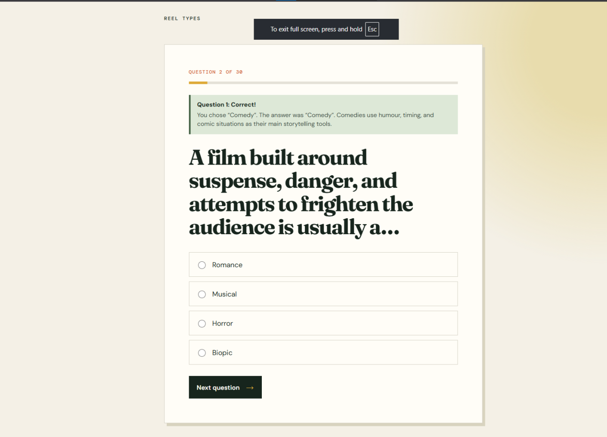
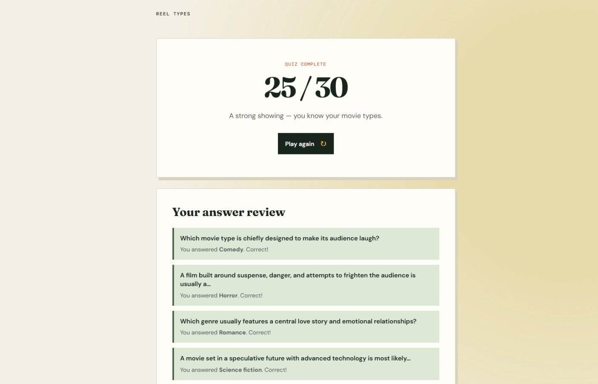

# Scorecard — Codex v3 Terra

## Legacy assessment

The pre-publication scorecard content below is retained verbatim. Its historical score uses a different maintainer scale and is not comparable to the canonical automated quality score.

> Maintainer record. This run used the original one-shot prompt shared by Claude and
> Codex v1; it is kept as a separate Codex v3 variant rather than renamed to v1.

| Metric | Value |
| --- | --- |
| Wall time | 4m 28s |
| Output tokens | 11.4k |
| Questions | 30 |
| Layout | `app.py` + templates/static |
| Test files | None |
| **Score** | **−1** |

## Observed facts

| Property | Value |
| --- | --- |
| New page per question | Yes — `/question/<number>` |
| State across pages | Flask signed session cookie: question index, score, answers, and previous response |
| Correct-answer position distribution | A:26 B:3 C:1 D:0 |
| Answer/category visible before answering | No |
| Anti-skip guard | Yes — the server requires the expected question number and validates submitted choices |
| Live score during quiz | No |
| Restart / Play Again | Yes — `Play again` resets the session at `/restart` |
| Results page | Score, performance message, and a full answer review |
| Final score correct | Yes — a complete correct-answer flow rendered 30/30 |
| Python test files | None |
| Self-testing | Unconfirmed |

## Notes

The model noticed an implementation issue during generation and fixed it mid-run, and it
did not reproduce the earlier lookahead problem. However, option A is correct for 26 of
30 questions (86.67%), which makes the answer pattern highly guessable. It created no app
test file, and self-testing is unconfirmed. The frontend is pretty meh, though the run is
both fast and exceptionally token-efficient at 4m 28s and 11.4k output tokens. **Final
score: −1.**

## Screenshots

| Start | Question | Finish |
| --- | --- | --- |
|  |  |  |

## Automated blind review

This section is generated from the canonical public aggregation. It is the completed benchmark quality assessment. The Legacy assessment above is retained historical maintainer material on a different scale and is not a competing total.

| Field | Value |
| --- | --- |
| Opaque submission ID | `submission-013` |
| Final review | [`../../../reviews/submission-013.md`](../../../reviews/submission-013.md) |
| Quiz type | knowledge |
| Questions / options | 30 / 4 |
| Launch / full flow | Yes / Yes |
| Content scope | Yes |
| Scoring/result | Yes |
| Answer leak / position distribution | No / A: 26, B: 3, C: 1, D: 0 |
| Skip/direct navigation | Unverified |
| Restart | Unverified |
| Tests present / pass status | No / N/A |
| Capture status | completed |
| Reviewer confidence | High |
| Disagreement status | Not assessed: one canonical blind pass; no independent second pass. |
| Build time | 4m 28s |
| Output tokens | 11.4k |

| Category | Rating | Weighted points |
| --- | ---: | ---: |
| Frontend visual quality and polish | 4/5 | 32/40 |
| UX and interaction design | 3/5 | 24/40 |
| Code quality and maintainability | 4/5 | 12/15 |
| Tests and verification evidence | 1/5 | 1/5 |
| **Quality score** |  | **69/100** |

Quality is recalculated from the integer ratings and excludes build time and output tokens.

### Fresh automated-review captures

These are the fresh headed Chromium captures used for the canonical blind review.

| Start | Question | Results |
| --- | --- | --- |
|  |  |  |
