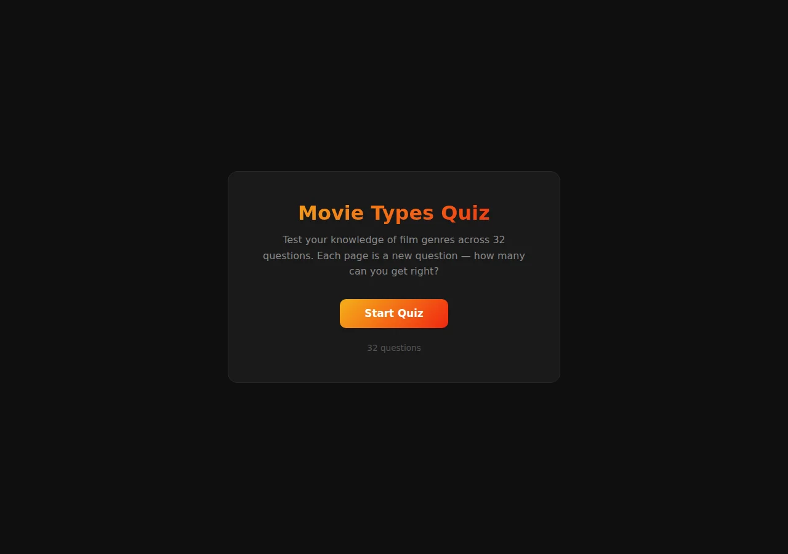
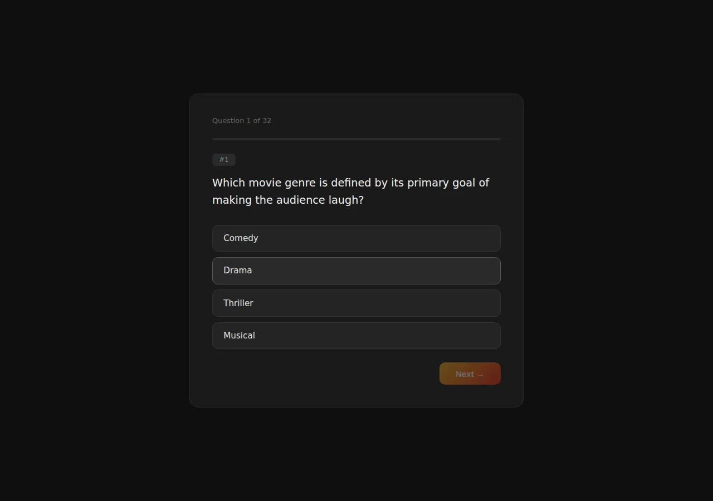
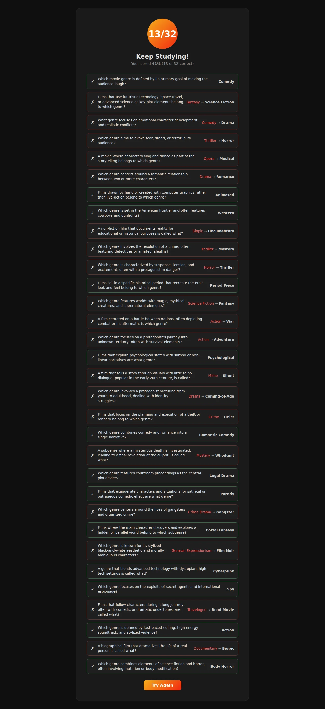

# Scorecard — Big Pickle (`big-pickle`)

## Legacy assessment

The pre-publication scorecard content below is retained verbatim. Its historical score uses a different maintainer scale and is not comparable to the canonical automated quality score.

> Factual record, compiled by automated assessment: static code read + live browser run
> (Chromium, fresh Flask launch, Python 3.12). The model's own files in this folder are
> exactly as it produced them. **The qualitative assessment and final score are for the
> repository maintainers** — see the last section.

## Build (opencode session, build turn only)

| Metric | Value |
| --- | --- |
| opencode model id | `big-pickle` |
| Provider / lab | OpenCode Zen (stealth model — originating lab undisclosed) |
| Wall time (build) | 1m 47s (107.5s) |
| Output tokens (build) | 6,970 |
| Reasoning tokens | 1,916 |

Build turn only: the one-shot prompt → files written. Later follow-up instructions in the
same session (`run on port 3000`, `run for me`) are excluded.

## Observed facts

| Property | Value |
| --- | --- |
| Runs (fresh Flask launch, Py3.12) | Yes — start → 32 questions → results, no runtime error |
| Questions | 32 |
| Options per question | 4 |
| New page per question | Yes (route `/quiz/<qid>`) |
| State across pages | Flask signed session cookie, `session["answers"]` = {qid: option text} |
| Correct-answer position distribution | A:13 B:14 C:5 D:0 |
| Answer/category visible before answering | No |
| Anti-skip guard | Empty POST re-renders the same question; `Next` disabled + radio `required` (client); direct GET to `/quiz/<qid>` not guarded |
| Live score during quiz | No |
| Restart / Play Again | Yes — "Try Again" → `/` (clears session) |
| Navigation | Forward-only (POST → qid+1); URLs are GET-addressable |
| Results page | Score X/32, percentage, performance message, per-question review (chosen vs correct) |
| Final score correct | Yes — option-A run scored 13/32, equal to the A-count |
| Python test files | None |
| `<meta viewport>` | Present |
| `secret_key` | `os.environ["SECRET_KEY"]` else random `uuid4().hex` |

Factual notes:
- Options are not shuffled; question order is fixed. 3 routes (`/`, `/quiz/<qid>`, `/result`).
- `/` clears the session on every visit. Source binds `port=3000`, `debug=True`.

## Screenshots

| Start | Question | Results |
| --- | --- | --- |
|  |  |  |

## Maintainer assessment

<!-- Repository maintainers: write the qualitative assessment (UI quality, polish,
     subjective calls) and assign the final score here. -->

**Score:** _TBD_

## Automated blind review

This section is generated from the canonical public aggregation. It is the completed benchmark quality assessment. The Legacy assessment above is retained historical maintainer material on a different scale and is not a competing total.

| Field | Value |
| --- | --- |
| Opaque submission ID | `submission-005` |
| Final review | [`../../reviews/submission-005.md`](../../reviews/submission-005.md) |
| Quiz type | knowledge |
| Questions / options | 32 / 4 |
| Launch / full flow | Yes / Yes |
| Content scope | Yes |
| Scoring/result | Yes |
| Answer leak / position distribution | No / 13 A / 14 B / 5 C / 0 D |
| Skip/direct navigation | Yes, direct bypass exists |
| Restart | Yes, source-verified |
| Tests present / pass status | No / N/A |
| Capture status | completed |
| Reviewer confidence | High |
| Disagreement status | Not assessed: one canonical blind pass; no independent second pass. |
| Build time | 1m 47s |
| Output tokens | 6,970 |

| Category | Rating | Weighted points |
| --- | ---: | ---: |
| Frontend visual quality and polish | 4/5 | 32/40 |
| UX and interaction design | 3/5 | 24/40 |
| Code quality and maintainability | 3/5 | 9/15 |
| Tests and verification evidence | 1/5 | 1/5 |
| **Quality score** |  | **66/100** |

Quality is recalculated from the integer ratings and excludes build time and output tokens.
