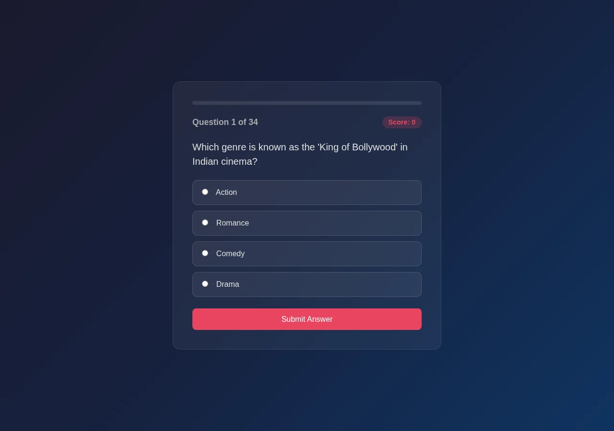
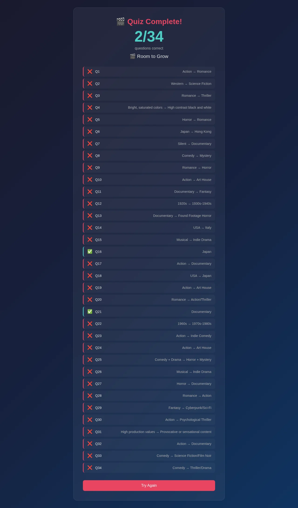

# Scorecard — MiMo v2.5 (`mimo-v2.5-free`)

> Factual record, compiled by automated assessment: static code read + live browser run
> (Chromium, fresh Flask launch, Python 3.12). The model's own files in this folder are
> exactly as it produced them. **The qualitative assessment and final score are for the
> repository maintainers** — see the last section.

## Build (opencode session, build turn only)

| Metric | Value |
| --- | --- |
| opencode model id | `mimo-v2.5-free` (variant: high) |
| Provider / lab | Xiaomi MiMo (served via OpenCode Zen) |
| Wall time (build) | 1m 35s (94.9s) |
| Output tokens (build) | 7,055 |
| Reasoning tokens | 443 |

Build turn only (single-turn session).

## Observed facts

| Property | Value |
| --- | --- |
| Runs (fresh Flask launch, Py3.12) | Yes — start → 34 questions → results, no runtime error |
| Questions | 34 |
| Options per question | 4 |
| App layout | Single `app.py` with inline templates (start, question, feedback, results) |
| New page per question | Yes (route `/question/<qnum>`); a separate feedback page follows each question (two pages per question) |
| State across pages | Flask signed session cookie: `current`, `score`, `answers` |
| Correct-answer position distribution | A:2 B:29 C:3 D:0 |
| Answer/category visible before answering | No (a hint shows the *previous* question's context) |
| Anti-skip guard | Radio `required` (client) only; server records a missing answer without blocking; direct GET allowed |
| Live score during quiz | Yes — "Score: N" badge on each question page (browser-confirmed) |
| Restart / Play Again | Yes — "Try Again" → `/` (clears session) |
| Navigation | Forward-only (question → feedback → next) |
| Results page | Score X/34, performance label, per-question review (no percentage figure) |
| Final score correct | Yes — option-A run scored 2/34, equal to the A-count |
| Python test files | None |
| `<meta viewport>` | Present |
| `secret_key` | `os.urandom(24)` (regenerated each process start) |

Factual notes:
- Options not shuffled; question order fixed. 3 routes (`/`, `/question/<qnum>`, `/results`).
- The start page hardcodes the literal "34" question count. `debug=True`.

## Screenshots

| Start | Question | Results |
| --- | --- | --- |
|  |  |  |

## Maintainer assessment

<!-- Repository maintainers: write the qualitative assessment (UI quality, polish,
     subjective calls) and assign the final score here. -->

**Score:** _TBD_
